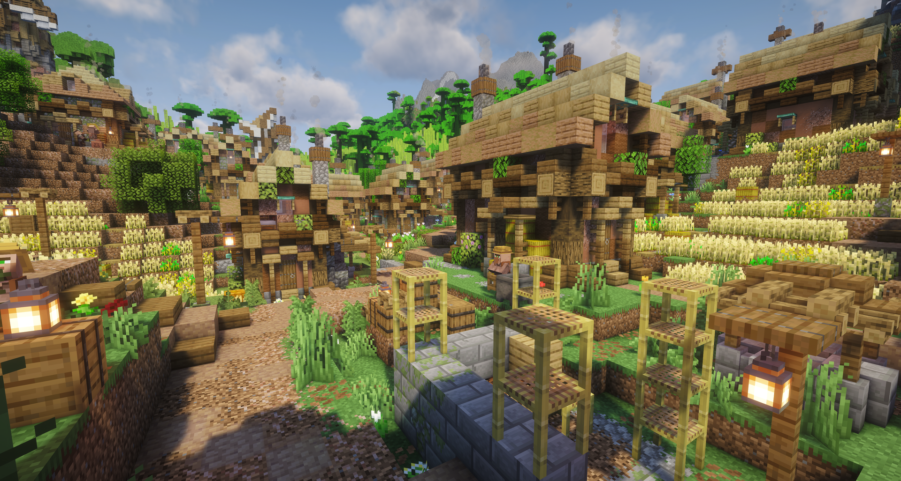
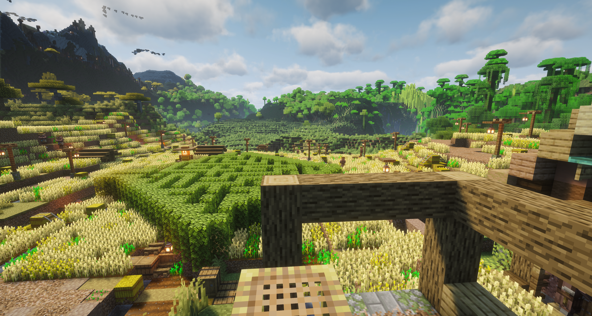
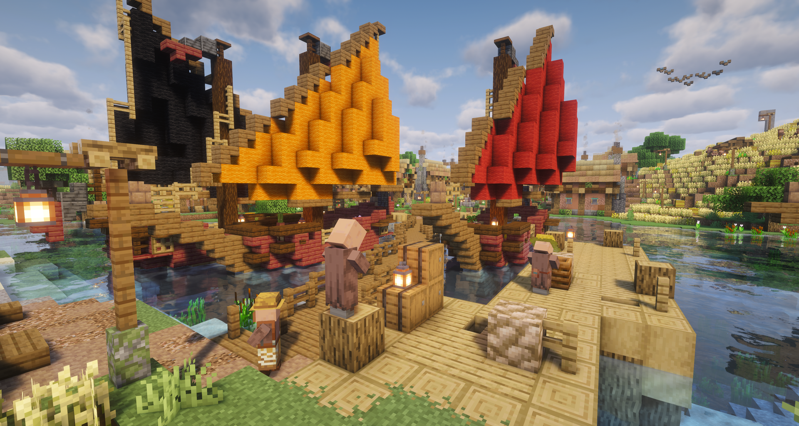
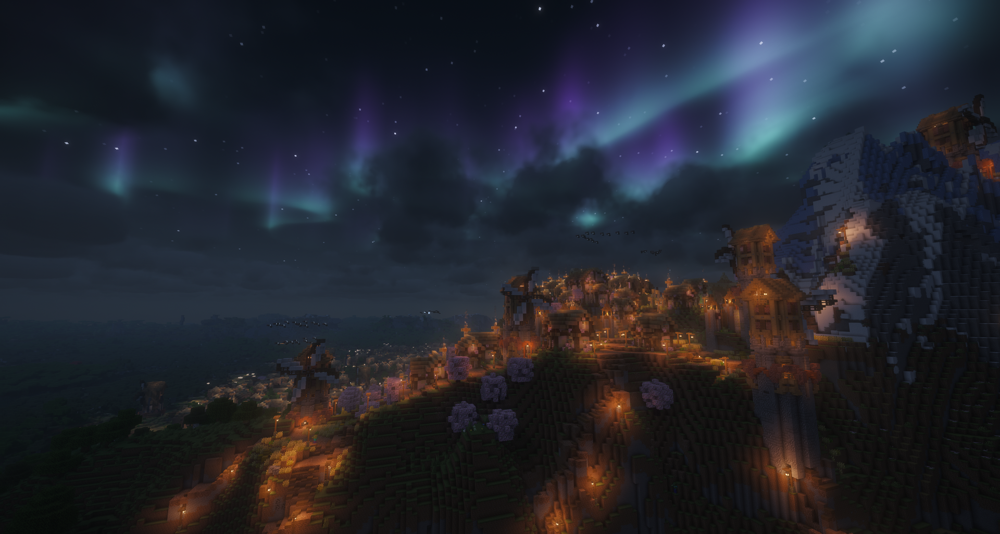
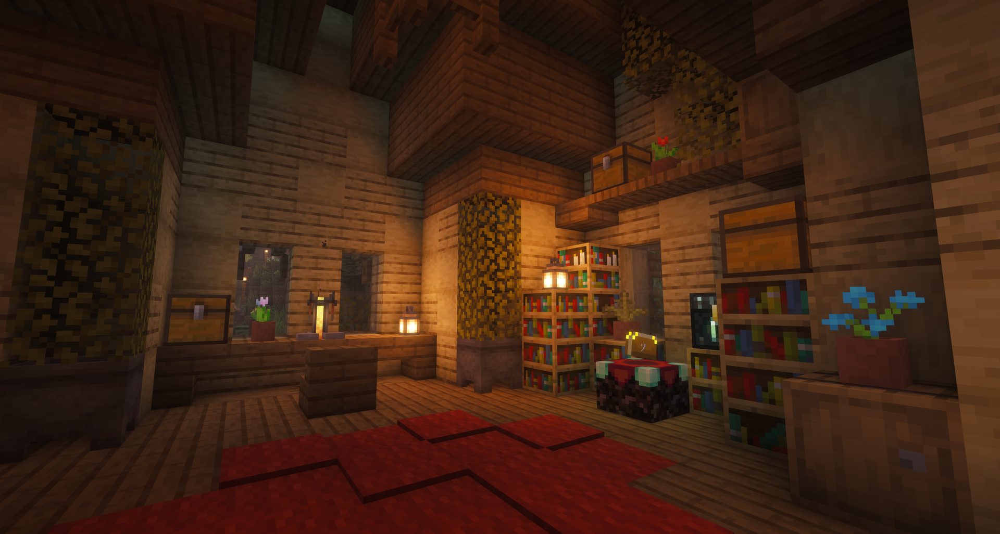
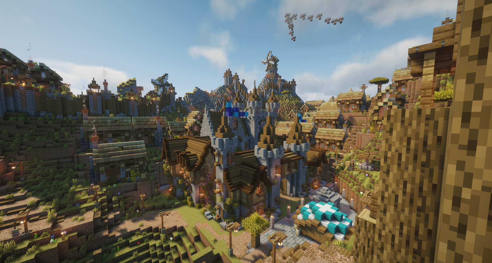
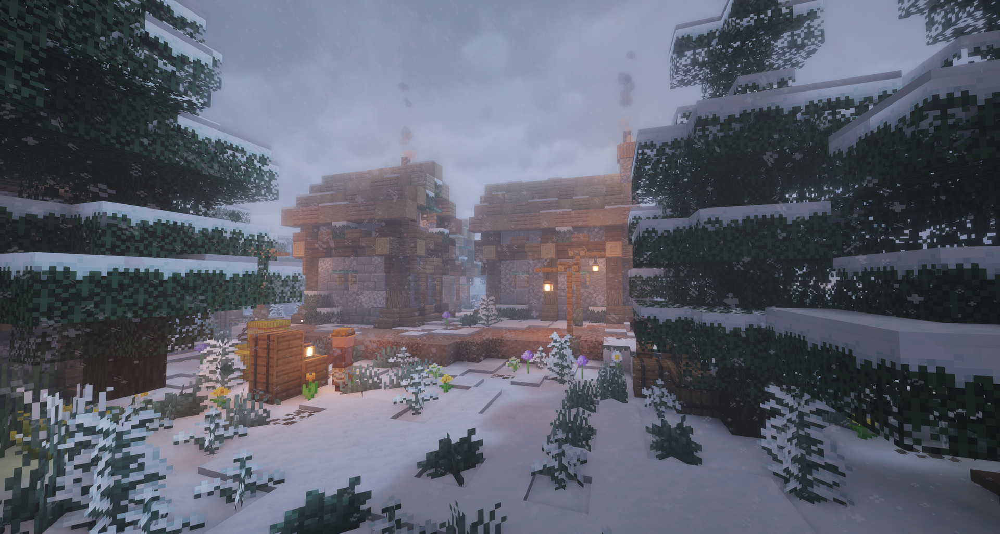
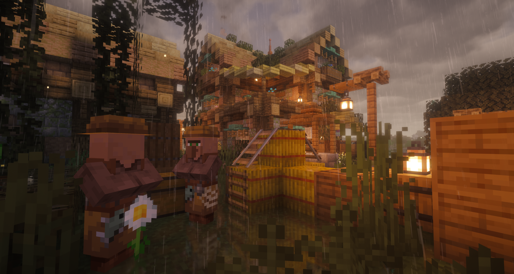
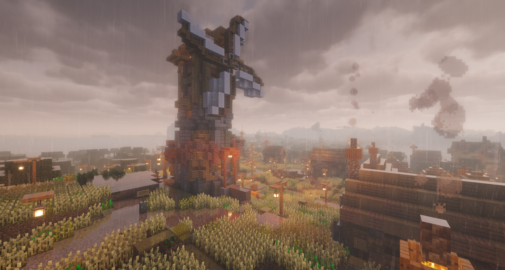
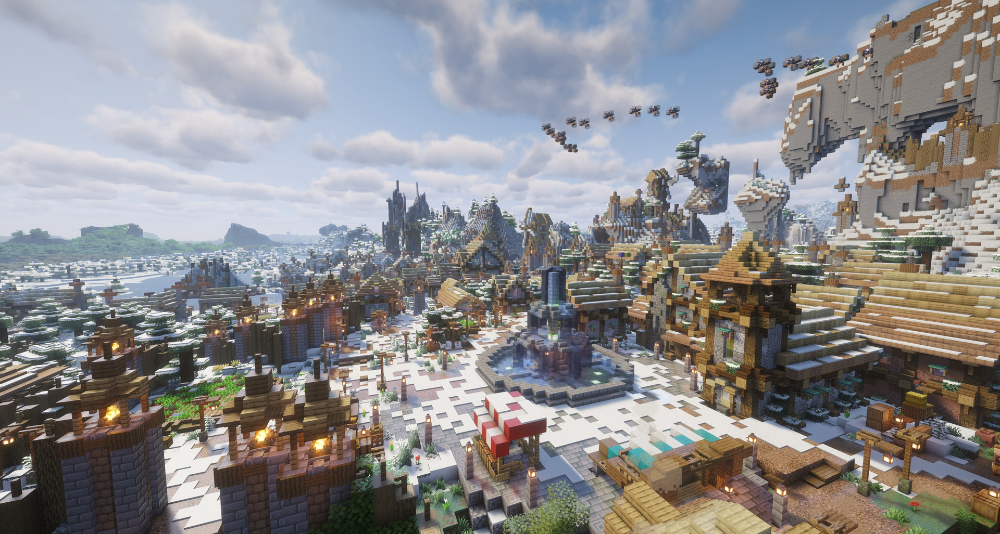

# Team Merge Conflict's 2026 Settlement Generator

**Authors:** Jort van Leenen, Robert Salden, Lana van Sprang, Niels Versteeg, and Jasper van der Zwet

Team Merge Conflict's submission for the 2026 Generative Design in Minecraft (GDMC) AI Settlement Generation
Challenge: an algorithm that generates a complete, terrain-adapted settlement for an unseen Minecraft map, without human
supervision.

## What it builds

Point the generator at a patch of land it has never seen, and it builds a whole town there from scratch. The town
grows around a market square, with homes, workshops, and civic buildings lining lantern-lit streets. When there is
enough room, a castle sits at its heart. A defensive wall wraps around the town, following the hills and valleys
instead of flattening them.

Outside the walls you'll find windmills, farmland, pastures, orchards, and, near water, a harbor. There's a graveyard
with a crypt, a few half-finished buildings that make the town feel like it's still growing, and gardens tucked into
the leftover corners. Animals graze in the fields, and every now and then a disaster leaves its mark on the town.
Once everything is built, the villagers move in.

No two towns are the same, because each one is shaped by the land it's built on. In the town center, a book on a
lectern tells the town's story: who lives there, what the districts are called, and who is buried in the graveyard.
The story is written with the help of an LLM.

## Gallery

<p align="center">
  
  
  
  
  
  
  
  
  
  
</p>

## Learn more

- [Technical report](docs/technical-report.pdf): a detailed write-up of how the generator works
- [Walkthrough video](https://www.youtube.com/watch?v=KjB2pHcj0ko): a guided tour of a generated settlement on YouTube
- [Leiden University news article](https://www.universiteitleiden.nl/en/news/2026/09/can-ai-build-a-beautiful-city-in-minecraft-these-leiden-students-did-it-better):
  *Can AI build a beautiful city in Minecraft? These Leiden students did it better*

## Requirements

- Python 3.12+
- A running Minecraft instance with the [GDMC HTTP interface](https://github.com/Niels-NTG/gdmc_http_interface)
  mod/plugin installed, with a build area already set (`/buildarea set`)
- (Optional) An OpenAI API key, used by the chronicle generator to write the settlement's narrative book

The generator manages its own world safety gamerules at runtime (disabling mob griefing, fire spread, and block/entity
drops), so no manual gamerule setup is needed beforehand.

## Installation

```bash
pip install -r requirements.txt
```

Create a `.env` file in the project root containing your OpenAI API key:

```text
OPENAI_API_KEY=your_api_key
```

## Usage

With a Minecraft world running, the GDMC HTTP interface active, and a build area set, run:

```bash
python src/main.py
```

Logging defaults to `INFO`. Pass `-v` to raise verbosity to `DEBUG`:

```bash
python src/main.py -v
```
